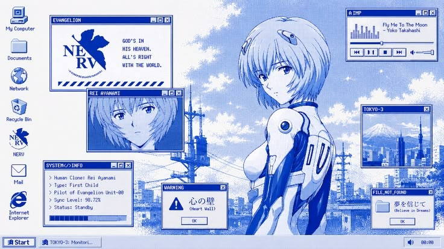

<h1 align="center">Hey, I'm Omar 👋</h1>

<p align="center">
  Current Full-stack developer (TypeScript · Next.js · PostgreSQL) — I like building cool and useful stuff.
</p>

<p align="center">
  <a href="https://github.com/ccwt3"></a>
  <a href="https://www.linkedin.com/in/oate/"></a>
  <a href="https://www.instagram.com/ccwt3_/"></a>
</p>

---

### About me



- 💻 Computer Systems Engineering student, Building my own projects on the side.
- ⚙️ Backend-leaning: I care about data modeling, security (auth) and building the logic behind the products.
- 🧰 Currently working on [Zvenira](https://github.com/ccwt3/Zvenira).
- 🤝 Open to junior / internship roles — remote-friendly, English C1.
- ♟️ Off-screen: competitive [chess](https://lichess.org/@/Cacawat3).

### Featured projects

- **[Motorefacciones](https://github.com/ccwt3/sm-ponce)** — Production motorcycle-parts inventory system. Next.js + Supabase, Postgres Row-Level Security, Google OAuth, debounced search with LRU caching and optimistic UI. → [Live](https://motorefacciones.reicot.dev)
- **[Silly Picker](https://github.com/ccwt3/youtube-picker)** — YouTube curation tool with an automated content pipeline (Gemini API generates queries, YouTube Data API fetches, results normalized into Postgres). → [Live](https://youtube-picker.vercel.app)
- **[Blog API](https://github.com/ccwt3/blog-API)** — REST backend for a multi-role blog (User/Author/Admin) with refresh-token rotation, Prisma/PostgreSQL, bcrypt, and input validation.
- **[Zephyriov](https://github.com/ccwt3/Zephyriov)** — App designed to take advantage of Spaced Repetition with opening theory study in chess.

<!--START_SECTION:waka-->


**🐱 My GitHub Data** 

> 📦 38.6 kB Used in GitHub's Storage 
 > 
> 🏆 184 Contributions in the Year 2026
 > 
> 🚫 Not Opted to Hire
 > 
> 📜 38 Public Repositories 
 > 
> 🔑 10 Private Repositories 
 > 
**I'm an Early 🐤** 

```text
🌞 Morning                398 commits         ████████░░░░░░░░░░░░░░░░░   31.22 % 
🌆 Daytime                509 commits         ██████████░░░░░░░░░░░░░░░   39.92 % 
🌃 Evening                344 commits         ███████░░░░░░░░░░░░░░░░░░   26.98 % 
🌙 Night                  24 commits          ░░░░░░░░░░░░░░░░░░░░░░░░░   01.88 % 
```
📅 **I'm Most Productive on Monday** 

```text
Monday                   263 commits         █████░░░░░░░░░░░░░░░░░░░░   20.63 % 
Tuesday                  108 commits         ██░░░░░░░░░░░░░░░░░░░░░░░   08.47 % 
Wednesday                190 commits         ████░░░░░░░░░░░░░░░░░░░░░   14.90 % 
Thursday                 242 commits         █████░░░░░░░░░░░░░░░░░░░░   18.98 % 
Friday                   157 commits         ███░░░░░░░░░░░░░░░░░░░░░░   12.31 % 
Saturday                 155 commits         ███░░░░░░░░░░░░░░░░░░░░░░   12.16 % 
Sunday                   160 commits         ███░░░░░░░░░░░░░░░░░░░░░░   12.55 % 
```


📊 **This Week I Spent My Time On** 

```text
🕑︎ Time Zone: America/Mexico_City

💬 Programming Languages: 
No Activity Tracked This Week

🔥 Editors: 
No Activity Tracked This Week

🐱‍💻 Projects: 
No Activity Tracked This Week

💻 Operating System: 
No Activity Tracked This Week
```

🤖 **AI Coding This Week** 

```text
No AI Coding Activity Tracked This Week
```

**I Mostly Code in JavaScript** 

```text
TypeScript               8 repos             █████░░░░░░░░░░░░░░░░░░░░   20.51 % 
CSS                      2 repos             █░░░░░░░░░░░░░░░░░░░░░░░░   05.13 % 
PLpgSQL                  1 repo              █░░░░░░░░░░░░░░░░░░░░░░░░   02.56 % 
Rust                     1 repo              █░░░░░░░░░░░░░░░░░░░░░░░░   02.56 % 
ShaderLab                1 repo              █░░░░░░░░░░░░░░░░░░░░░░░░   02.56 % 
```


**Timeline**


 Last Updated on 29/07/2026 16:21:15 UTC
<!--END_SECTION:waka-->

### Current TechStack
<p align=center>
  
  
  
  
  
  
</p>

### Learning by Doing
<p align=center>
  
  
</p>
